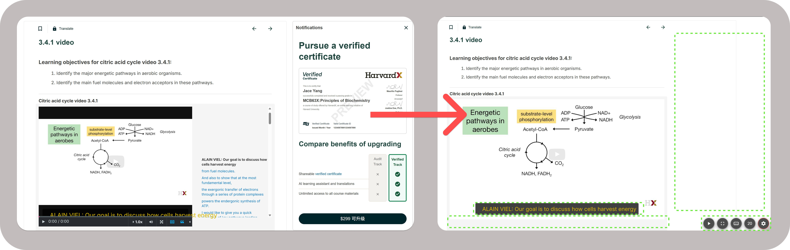

# EDX Video Widget

Enhanced video controls and clean interface for EDX learning platform.

## About

I love edX's collaboration with institutions to provide education for all—kudos to them. However, the platform's tech quality has room for improvement. This extension addresses some flaws, such as the distracting control bar below lecture videos, which constantly shows progress and ticking time (reminiscent of Gen Alpha needing side distractions like Subway Surfer to focus). It also hides persistent upgrade popups that feel like harassment rather than revenue requests. Ultimately, do we really need a certificate to prove learning? If you've truly absorbed the material, that knowledge shines through without a digital paper.

## Features
- **Control bar toggle & quick access** - Show/hide video controls with quick play/pause, fullscreen, and subtitle access
- **Better subtitles** - 5 size options (20px to 36px), single line, closer to bottom
- **Auto-hide upgrade popups & side panel** - No annoying certificate upgrade shenanigans

## Installation

1. Go to `chrome://extensions/`
2. Enable "Developer mode"
3. Click "Load unpacked" and select this folder

## Usage

### Extension Popup
Click the extension icon to access:
- **Enable Widget** - Turn all features on/off
- **Hide Sidebar** - Show/hide notification sidebar
- **Hide Transcript** - Show/hide video transcript panel

### Floating Buttons
Horizontal button row in bottom-right corner:
- **Control bar toggle** (rightmost gear icon) - Always visible
- **4 additional buttons** appear when control bar is hidden (left to right):
  - Play/pause video
  - Fullscreen
  - Toggle subtitles on/off
  - Adjust subtitle size (cycles: 20px → 24px → 28px → 32px → 36px)

## Troubleshooting

If the extension doesn't work:
1. When in doubt, refresh the EDX page (primarily because of disabling the popup, known issue.)
2. PR for a hotfix

## License

MIT